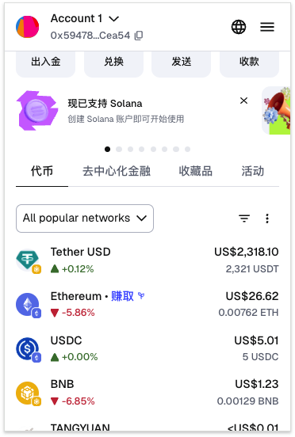

# Brand & Logos

### 📜 Introduction

SwapX logo downloads are at the bottom of this page, but please be sure to read these guidelines first.

Although SwapX distributes some of its technology under open-source licenses, the **SwapX brand** is not distributed under the same licenses.

The following SwapX "**Brand Assets**" are copyrighted material, and you may only use them in accordance with the policy detailed below:

* The SwapX logos, wordmark, icon
* The SwapX name
* Other visual assets produced by SwapX including but not limited to illustrations and 3d models

***

### ✅ What You May Do

You may use SwapX's Brand Assets when you are:

👌 Referring to our products and services. 👌 Linking to our official site or products, such as "Trade our token on SwapX". 👌 Announcing an official partnership, but only if you have official approval by a qualified member of the SwapX team.

For information on other uses of our Brand Assets, please reach out at **info@swapx.com**.

***

### ⛔ What You May Not Do

While we strongly believe in and follow the open-source ethos, protecting the SwapX brand is extremely important for our users' security, so that users know what is a genuine product/endorsement and what isn't.

Here are a few examples of **forbidden uses** of our Brand Assets:

⛔️ **Don't use our Brand Assets in your products' name, logo, NFTs, etc.**

* For example, making an app called "SwapX Engine" or "SwapX Child" is not allowed.
* Don't use the SwapX logo in whole or in part as part of your products' logos, marketing material, website, or other.
* Logos with a strong resemblence to the SwapX Icon are also forbidden.

⛔️ **Don't use our Brand Assets to create digital or physical products for sale**, including but not limited to:

* Merchandise ("Swag")
* NFTs
* Other products

⛔️ **Don't create derivative names that imply official endorsement.**

* For example, don't make a social media group called "SwapX Italy" - this sounds official. "SwapX Fans of Italy" may be permitted.

⛔️ **Don't change or adapt our Brand Assets in any way.**

* Use the logos and other assets exactly as provided. Do not change the colors, reassemble, abbreviate, or change these assets in any way.

***

Use your common sense and creativity. If you want to make something relating to the SwapX ecosystem, make it your own.

Have fun making a unique brand that's clearly yours -- if your product is strong, you won't need to rely on remixing SwapX's brand.

### 📥 SwapX Logo Downloads

<figure><figcaption></figcaption></figure>

<figure><figcaption></figcaption></figure>

